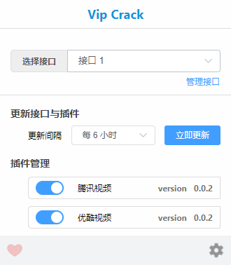
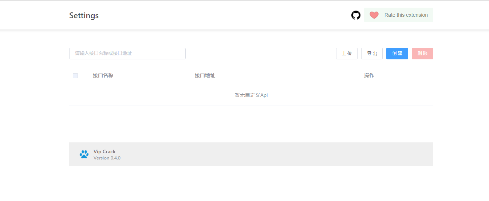

*本人最近在找工作，有问题或建议可提 issue，日后有时间再看*

# Vip crack

直接在原视频网站上观看 vip 视频，无需再前往第三方网站，目前仅支持腾讯视频和优酷视频。

去除广告，并具备弹幕、历史记录等完整行为

## 安装

占位，等我上传 chrome 和 edge 市场

## 使用

安装完扩展后，无需任何操作，正常点开腾讯视频或优酷视频，即可观看 vip 视频

## 配置

当扩展激活时，扩展图标（地址栏右侧）高亮，否则置灰

> 新版 chrome 默认将扩展图标隐藏起来，需自己将其固定住才看得到

点击扩展图标（地址栏右侧），可以查看配置面板

主要分为两个区域。

扩展内置了多个解析接口，通过`选择接口`下拉框，用户可自行选择

> 接口全部来源于网络

点击`管理接口`，可自定义接口，后面会再提到

默认 6 小时同步一次接口和插件，也可以自行修改

插件管理列出了已支持的网站，如果已有某个网站的 vip 账号，可以点击插件名前方的蓝色开关将其关闭

## 自定义接口

点击配置面板右下角的齿轮，或者对扩展图标右键 - 选项，跳转至自定义接口页面

支持 **创建**、**上传**、**导出**、**删除** 接口

可以自己创建接口，也可以上传其它人导出分享的 txt 文件

## 声明

所有接口来源于网络收集，仅供学习交流
